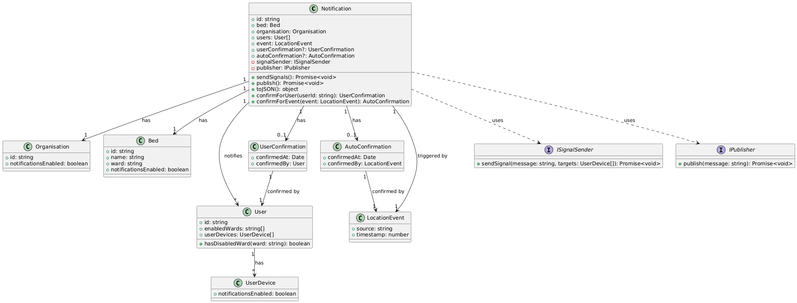
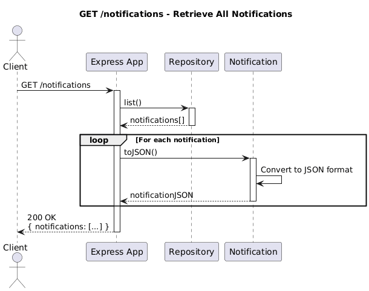
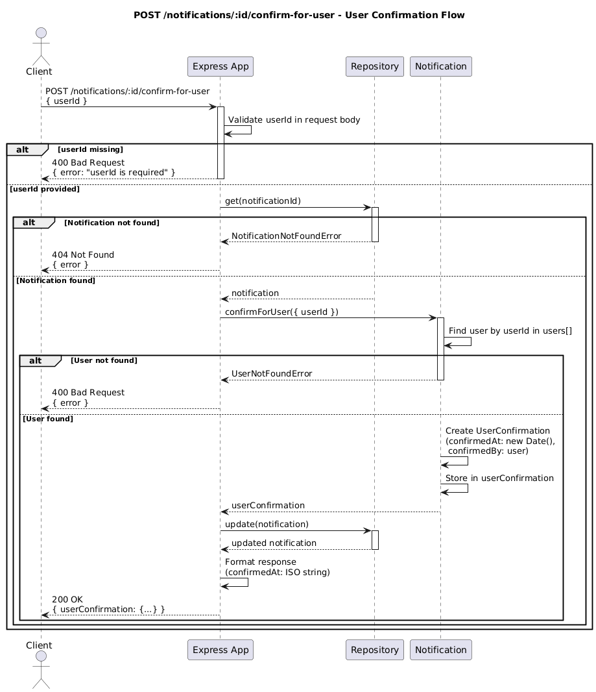
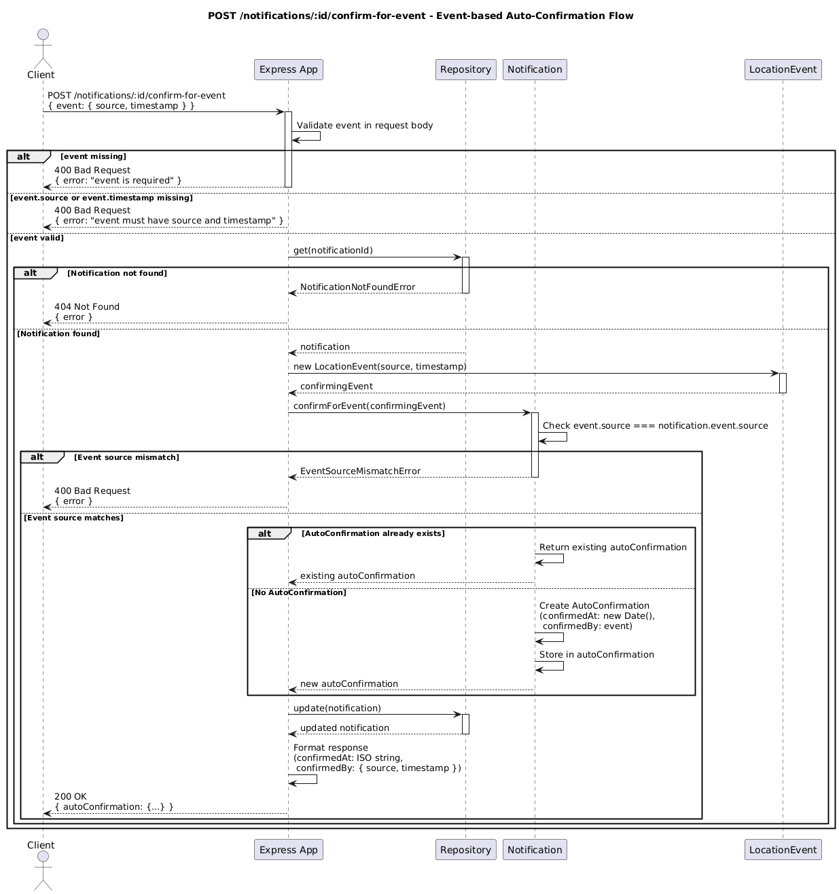
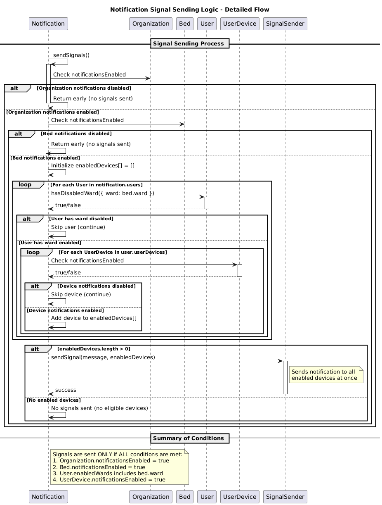
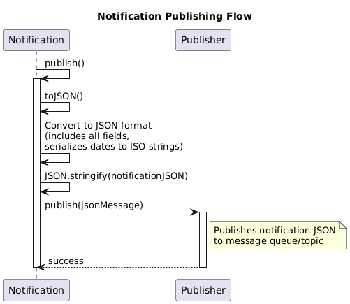

# Nurse Call System - Technical Assignment

## Introduction

This project is a **Nurse Call System** implementation completed as part of a technical assessment. The system is designed to send alerts to nurses when residents of a nursing home need assistance, ensuring that notifications reach the correct users and devices based on various configuration settings.

### What This System Does

The Nurse Call System handles:
- **Notification Management**: Creating and managing notifications for nursing home residents
- **Smart Signal Routing**: Intelligently routing notifications to nurses based on:
  - Organization-level notification settings
  - Bed-specific notification preferences
  - User ward assignments
  - Individual device notification settings
- **Confirmation Tracking**: Supporting both manual user confirmations and automatic event-based confirmations
- **Event Publishing**: Publishing notifications to message queues for downstream processing

### Architecture Overview

The application follows a **layered architecture** (Domain-Driven Design approach) with clear separation of concerns:

- **Domain Layer**: Core business logic and entities (Notification, User, Bed, Organization, etc.)
- **Application Layer**: HTTP endpoints and request/response handling (Express.js)
- **Infrastructure Layer**: Repository implementations and external service interfaces

## System Architecture

### Domain Model

The following class diagram illustrates the relationships between all domain entities:

### Application Flows

The system supports several key workflows, each documented with sequence diagrams:

#### 1. Retrieving Notifications

Flow for retrieving all notifications via the GET endpoint:

#### 2. User Confirmation

Flow for when a nurse manually confirms a notification:

#### 3. Event-based Auto-Confirmation

Flow for automatic confirmation based on location events:

#### 4. Signal Sending Logic

Detailed flow showing how notifications are filtered and sent to user devices:

#### 5. Notification Publishing

Flow for publishing notifications to message queues:

## Implementation Summary

### Completed Features

✅ **Domain Layer**
- Implemented all Notification entity methods:
  - `toJSON()` - Serialization to JSON format
  - `sendSignals()` - Intelligent signal routing with multi-level filtering
  - `publish()` - Publishing to message queues
  - `confirmForUser()` - User confirmation with validation
  - `confirmForEvent()` - Event-based confirmation with source matching

✅ **Application Layer**
- Implemented REST API endpoints:
  - `GET /notifications` - Retrieve all notifications
  - `POST /notifications/:id/confirm-for-user` - User confirmation
  - `POST /notifications/:id/confirm-for-event` - Event-based confirmation
- Comprehensive error handling (404, 400, 500)
- Request validation

✅ **Architecture**
- Organized code into layered architecture (Domain, Application, Infrastructure)
- Proper separation of concerns
- Dependency inversion principles

✅ **Documentation**
- Class diagram showing domain relationships
- Sequence diagrams for all application flows
- Error handling with custom domain errors

### Technical Highlights

- **Test-Driven Development**: All features implemented following TDD principles
- **Type Safety**: Full TypeScript implementation with proper type definitions
- **Error Handling**: Custom domain errors (UserNotFoundError, EventSourceMismatchError, NotificationNotFoundError)
- **In-Memory Storage**: Repository pattern with in-memory implementation for testing
- **Signal Filtering**: Multi-level filtering (Organization → Bed → User Ward → Device)

## Project Structure

src/
├── domain/ # Domain Layer
│ ├── errors/ # Domain-specific errors
│ ├── Notification.ts # Core notification entity
│ ├── User.ts
│ ├── Bed.ts
│ └── ...
├── application/ # Application Layer
│ ├── app.ts # Express application setup
│ └── app.spec.ts # Integration tests
└── infrastructure/ # Infrastructure Layer
├── repositories/ # Data access
└── services/ # External service interfaces

## Setup Instructions

1. Install Node.js 20.0.0 or later
2. Enable corepack: `corepack enable`
3. Install dependencies: `yarn`
4. Run tests: `yarn test`
5. Start the server: `yarn start` (runs on port 3000)

## Running the Application

# Run all tests
yarn test

# Start the development server
yarn start
